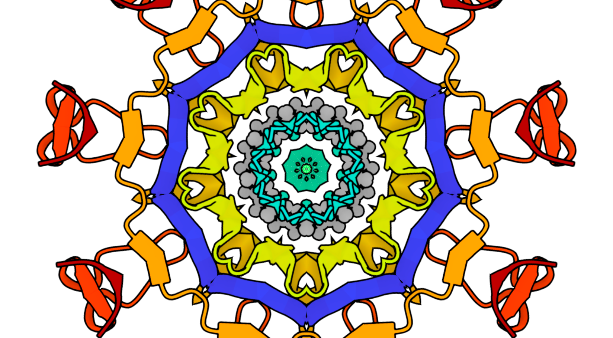

# KaleidoMol

A kaleidoscopic protein structure viewer. Enter any PDB code and watch the molecule transform into a living mandala.

**[Live demo](https://cing.github.io/KaleidoMol/)**



## Features

- **Load any protein** from the PDB by code (e.g. `1cbs`, `4hhb`) or browse a local PDB/CIF file
- **Representations** — cartoon, spacefill, and molecular surface rendering styles
- **Illustrative** — switches Mol\* to a cel-shaded outline style
- **Slices** — number of wedges in the kaleidoscope pattern
- **Zoom** — how much of the protein source is magnified into each wedge
- **Mirror** — flips alternating wedges to create seamless symmetry
- **Reflect** — adds a mirrored ring around the outer edge of the pattern
- **Auto spin** — continuously rotates the kaleidoscope
- **Drift** — mouse position shifts the pattern center for interactive exploration
- **Pulse** — rhythmic zoom oscillation
- **Glow** — bloom post-processing that makes the pattern emit light
- **Trails** — ghost copies that lag behind the main pattern during motion
- **Double layer** — overlays a second counter-rotating kaleidoscope with screen blending
- **Audio drive** — microphone input drives zoom, rotation, and drift in real time (Essentia.js)
- **Foreground / background gradients** — color presets that tint the pattern and background
- **PNG export** — save a snapshot of the current view

## Keyboard shortcuts

| Key | Action |
|-----|--------|
| `f` | Cycle foreground gradient |
| `b` | Cycle background gradient |
| `r` | Cycle representation (cartoon / spacefill / surface) |
| `m` | Toggle mirror |
| `o` | Toggle reflect |
| `s` | Toggle auto spin |
| `p` | Toggle pulse |
| `d` | Toggle drift |
| `g` | Toggle glow |
| `i` | Toggle illustrative |
| `l` | Toggle double layer |
| `t` | Toggle trails |
| `h` | Hide / show controls |
| `x` | Save PNG snapshot |
| `[` / `]` | Decrease / increase slices |
| `↑` / `↓` | Increase / decrease zoom |
| `←` / `→` | Decrease / increase spin speed |

## How it works

KaleidoMol embeds a [Mol\*](https://molstar.org/) protein viewer in a hidden iframe, captures its canvas output, and renders it through a kaleidoscopic transform — slicing the image into pie-shaped wedges, mirroring alternating slices, and rotating the result. The kaleidoscope and viewer communicate via `postMessage` to synchronize colors, representations, and structures.

## Running locally

Serve the files with any static HTTP server:

```bash
python -m http.server
```

No build step, no dependencies, no package manager.

## License

MIT
